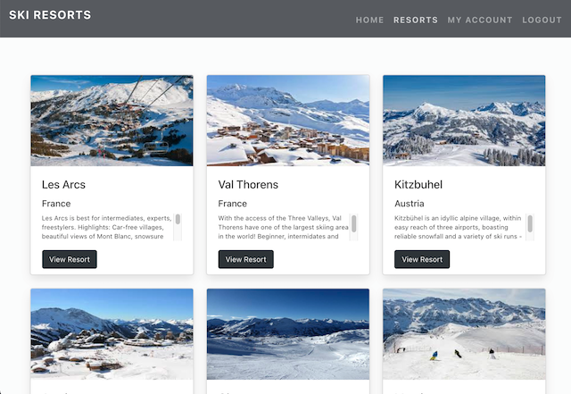
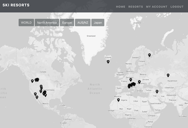
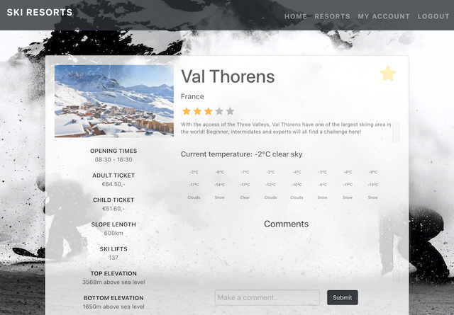
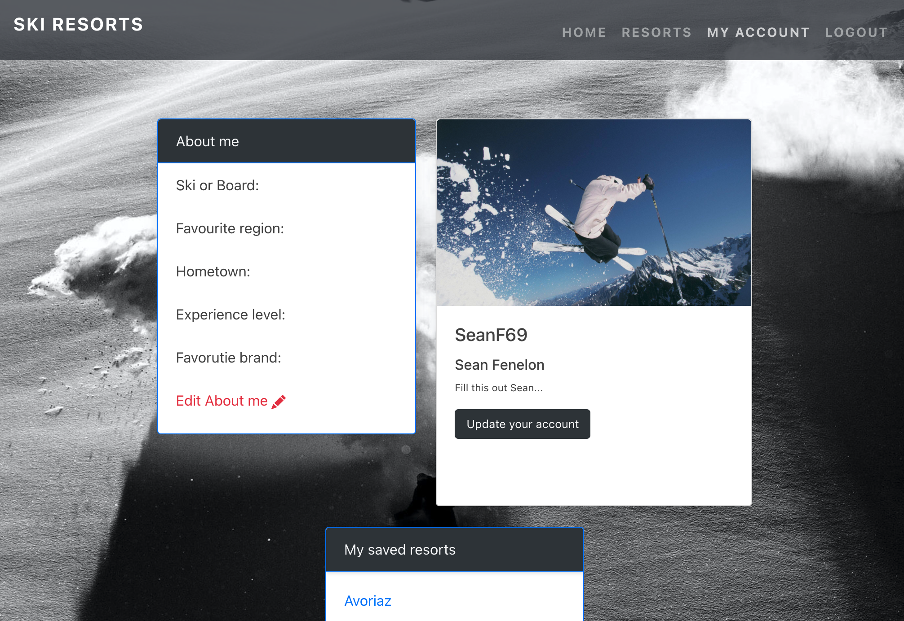

##  General Assembly, Software Engineering Immersive

# Project 3: Skii
<p align="center">
  
</p>

## Overview

Skii is global ski resort database. This was the third project of the General Assembly Software Engineering Immersive.

This week-long, four-person project culminated in a full-stack application built using React, Express, MongoDB anf Node.

The application has information on global ski resorts, and a user-interface encouraging a commuunity of adrenaline junkies to share their thoughts and opinions and build their profiles!


[Check it out!](https://project-3-ski-sean.herokuapp.com/)


## Brief

- Create a MERN full stack website.
- The app had to give functionality to the user, with a login/register page and to implement an API to reveal information.
- Our site was to be deployed using Heroku and the MongoDB Atlas database.
- Give the project meaning, as if the user would actually find the experience useful.
- Use a framework for responsiveness.
- Stick with KISS (Keep It Simple Stupid) and DRY (Don't Repeat Yourself) principles.
- Use best practices for writing code, such as semantic markup.

**Technologies used:**

- HTML5
- CSS
- JavaScript ES6
- Git
- GitHub
- Mongoose
- MongoDB
- Express
- React
- Node
- Bootstrap framework
- Cloudinary
- Axios
- Bcrypt
- Json Web Token
- React native maps
- React Hooks
- Font Awesome
- React Reveal
- External weather API

## Approach

### Planning:

Initial planning consisted of coming up with our idea, searching for an API, wireframing and fleshing out our concept. Some of this includes:

- The various schemas and models
- Controllers and routes
- Information seeding (manual or external API)
- Frontent components and user interaction
- MVP and stretch goals
- Version control 

This initial planning ensured all team-members had a cohesive understanding of the goals and objectives and the tasks required to achieve these. Daily standups were then essential to the smooth flow of work.

We decided to construct a ski resorts website where the resorts were displayed using React native maps, and the user could check out information on each resort and interact with it such as add a star rating, post comments and add a resort to their favourites. Current weather conditions must be shown for each resort. An account section would let the user change the personal information and upload an avatar.

On the back-end, I collaborated on the user logic, and was responsible for the home page and resort pages on the front-end. 

Bootstrap was used as our CSS framework, led by Kasjan and implemented by the group.


## The resorts

After searching many ski API's, we couldn't find one to suit our needs and decided to create our own database with ski resort data taken from the web. The updating weather conditions are taken from an external open source weather API.


## Home Page

<p align="center">
  
</p>
Using MapBox, the ski resorts from our API were seeded and displayed here as markers. Longtitude and lattitude are useful here as well as in the external weather API. The user can toggle different regions of the world with a simple nav bar.


- A function toggling North America

```js
  function goToNorthAmerica() {
    const NorthAmericaViewport = {
      latitude: 37,
      longitude: -102,
      zoom: 3,
      height: '100vh',
      width: '100vw'
    }
    setViewPort(NorthAmericaViewport)
  }
```
- Here the resorts are mapped into mapbox, a React Link is used to send the user to the desired resort on click.

```js
      {resorts.map((resort, index) => {
        return <Link to={`/resorts/${resort.name}`} key={index}>
          <Marker
            latitude={resort.lat}
            longitude={resort.lon}
          >
            
          </Marker>
        </Link>
      })}
    </MapGL>
```


## Resort Page

<p align="center">
  
</p>

The singular resort page gives all the information about a given resort.


- Here the external weather API is used to .map the next 7 days of weather.

``` js
{weather.daily.map(day => {
                    return <div className="col" key={day.dt}><p>{(day.temp.max - 273) | 0}°C</p> <p>{(day.temp.min - 273) | 0}°C</p> <p>{day.weather[0].main}</p></div>
                  })}
```

- The comments section, a registered used can post a comment, and delete previous comments if they are the owner of the given comment.

``` js
{singleResort.comments && singleResort.comments.map(comment => {

                  return <div key={comment._id} className="row comments-spaced text-center">

                    <p className="comment-user">{comment.user.username}</p>
                    <p className="comment">{comment.text}</p>

                    {isCreator(comment.user._id) && <div>

                      <a className="trash-icon" onClick={() => handleDeleteComment(comment._id)}>{trash}</a>
                    </div>}

                  </div>

                })}
```


## Authentication

A middleware was working as a secure route to determine who the active user was and his/her permissions. It is used in the following scenarios:

- Editing a profile
- Removing a profile
- Creating a comment
- Deleting a comment
- Adding a resort to favourites
- Removing a resort from favourites

- Checking for a token:

```js
if (!authToken || !authToken.startsWith('Bearer')) {
    return res.status(401).send({ message: 'Unauthorised' })
  }
```

- A users token is verified as a second security step. Jwt.verify is used to match the user in the database. Potential errors are being listened for using .catch and returned accordingly.

```js
  jwt.verify(token, secret, (err, payload) => {
    if (err) return res.status(401).send({ message: 'Unauthorised' })

    const userId = payload.sub
    User
      .findById(userId)
      .then(user => {
        if (!user) return res.status(401).send({ message: 'Unauthorised' })

        req.currentUser = user

        next()
      })
      .catch(()=> res.status(401).send({ message: 'Unauthorised' }))
  })
```

Here is a a pre save function used to encrypt the users password upon registration and writing to the Users model.

```js
  .pre('save', function hashPassword(next) {
    if (this.isModified('password')) {
      this.password = bcrypt.hashSync(this.password, bcrypt.genSaltSync())
    }
    next()
  })
```

- The user model:

```js
const schema = new mongoose.Schema({
  username: { type: String, required: true, unique: true },
  email: { type: String, required: true, unique: true },
  password: { type: String, required: true },
  firstname: { type: String },
  lastname: { type: String },
  bio: { type: String },
  image: { type: String },
  isAdmin: { type: Boolean },
  favourites: { type: Array },
  ski_or_board: { type: String },
  favourite_region: { type: String },
  hometown: { type: String },
  experience: { type: String },
  favourite_brand: { type: String }
})
```

## My account

<p align="center">
  
</p>
The ability to edit personal infromation, avatar and check out added favourites was implemented.


- Here is axios fetching our current user, to retrieve their information

```js
  useEffect(() => {
    axios.get(`/api/users/${props.match.params.id}`)
      .then((resp) => {
        updateFormData(resp.data)
        updateAccountData(resp.data)
        updateFavourites(resp.data.favourites)
      })
  }, [])
```

- A simple ul to show information:

```js
          <ul className="list-group list-group-flush card-transparent">
            <li className="list-group-item card-transparent">Ski or Board:  {formData.ski_or_board}</li>
            <li className="list-group-item card-transparent">Favourite region: {formData.favourite_region}</li>
            <li className="list-group-item card-transparent">Hometown:  {formData.hometown}</li>
            <li className="list-group-item card-transparent">Experience level:  {formData.experience}</li>
            <li className="list-group-item card-transparent">Favorutie brand:  {formData.favourite_brand}</li>
            <Link to={`/users/aboutme/${props.match.params.id}`}><li className="list-group-item text-danger card-transparent">Edit About me {pencilIcon}</li></Link>
          </ul>
```

- Mapping out the users favourites:

```js
            {formData && favourites.map((property, index) => {

              return <div key={index}>

                <Link to={`/resorts/${property}`}>{property}</Link>

              </div>

            })}
```

- A cloudinary widget implemented to allow the user to upload an avatar in the update acccount option

```js
    window.cloudinary.createUploadWidget(
      {
        cloudName: 'dzt94',
        uploadPreset: 'skiresortapp',
        cropping: true
      },
      (err, result) => {
        if (result.event !== 'success') {
          return
        }
        axios.put(`/api/users/${props.match.params.id}`, { image: result.info.secure_url }, {
          headers: { Authorization: `Bearer ${token}` }
        })
          .then((res) => updateFormData(res.data))
      }
    ).open()
  }
```

## Our API

The seed file we used to populate our API, with 40 resorts and a couple of test users. Here is an example.

```js 
{
mongoose.connect(
  dbURI,

  { useNewUrlParser: true, useUnifiedTopology: true, useCreateIndex: true },
  (err) => {

    if (err) return console.log(err)
    console.log('Mongoose connected!')

    mongoose.connection.db.dropDatabase()

      .then(() => {
        return User.create([
          {
            username: 'Admin',
            email: 'admin@admin.com',
            password: 'admin',
            passwordConfirmation: 'admin',
            image: 'https://i.imgur.com/4f1MbGO.png?1',
            isAdmin: true,
            favourites: [],
            ski_or_board: '',
            favourite_region: '',
            hometown: '',
            experience: '',
            favourite_brand: ''
          },
          
          ...
          
          
                .then((users) => {
        return Resorts.create([

          {
            name: 'Val Thorens',
            country: 'France',
            top_elevation: 3568,
            bottom_elevation: 1650,
            lon: 6.58000,
            lat: 45.29806,
            image: 'https://i.imgur.com/LumFgEX.jpg',
            user: users[0],
            description: 'With the access of the Three Valleys, Val Thorens have one of the largest skiing area in the world! Beginner, intermidates and experts will all find a challenge here!',
            skilifts: '137',
            openingtimes: '08:30 - 16:30',
            slopeslength: '600km',
            adultticket: '€64.50,-',
            childticket: '€51.60,-',
            userRating: 4,
            numOfRatings: 0
          },
```


## Bugs (Fixed)

- Fixed bootstrap card scaling when variable resort information length is given.
- Fixed image upload from cloudinary

 

## Potential future features

- Star and favourite option to show active status when page is refreshed/re-visited.
- Add a direct messaging inbox between users.
- Show active weather on the resort cards page.
- Ability to add and edit resorts by users.

## Victories and Key Learnings

- Successful version control through Git.
- Collaborating on a full-stack application with a team of four. During daily standups, we discussed each others work, planned for the day and at times requested help from team members who may have worked on similar elements combining indivudal and pair programming.
- Learned Bootstrap and became more adept and reading documentation.

## Artworks

Background

- [Pixabay](https://pixabay.com/)
- [imgur.com](https://imgur.com/)

Icons

- [Font Awesome
](https://fontawesome.com/)

## Contributors

- [Kasjan Hinc](https://github.com/KasjanHinc)
- [Daniel Tockan](https://github.com/DanielTockan)
- [Sean Fenelon](https://github.com/seanfenelon)
- [Omar Alawi](https://github.com/omaralawi1)


